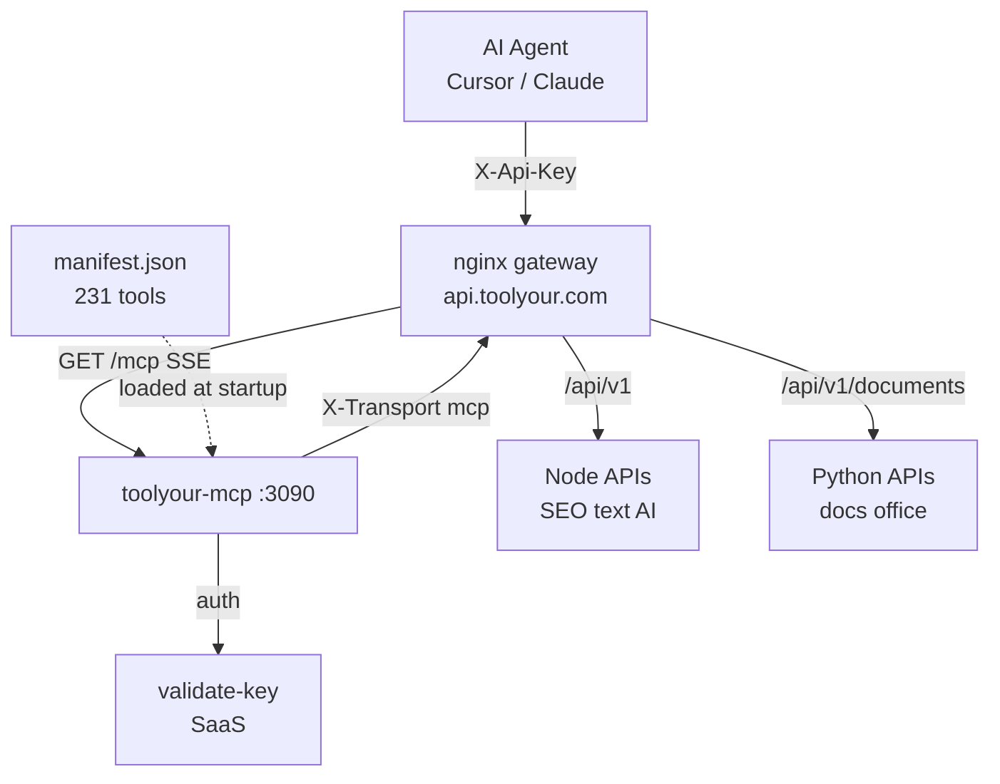
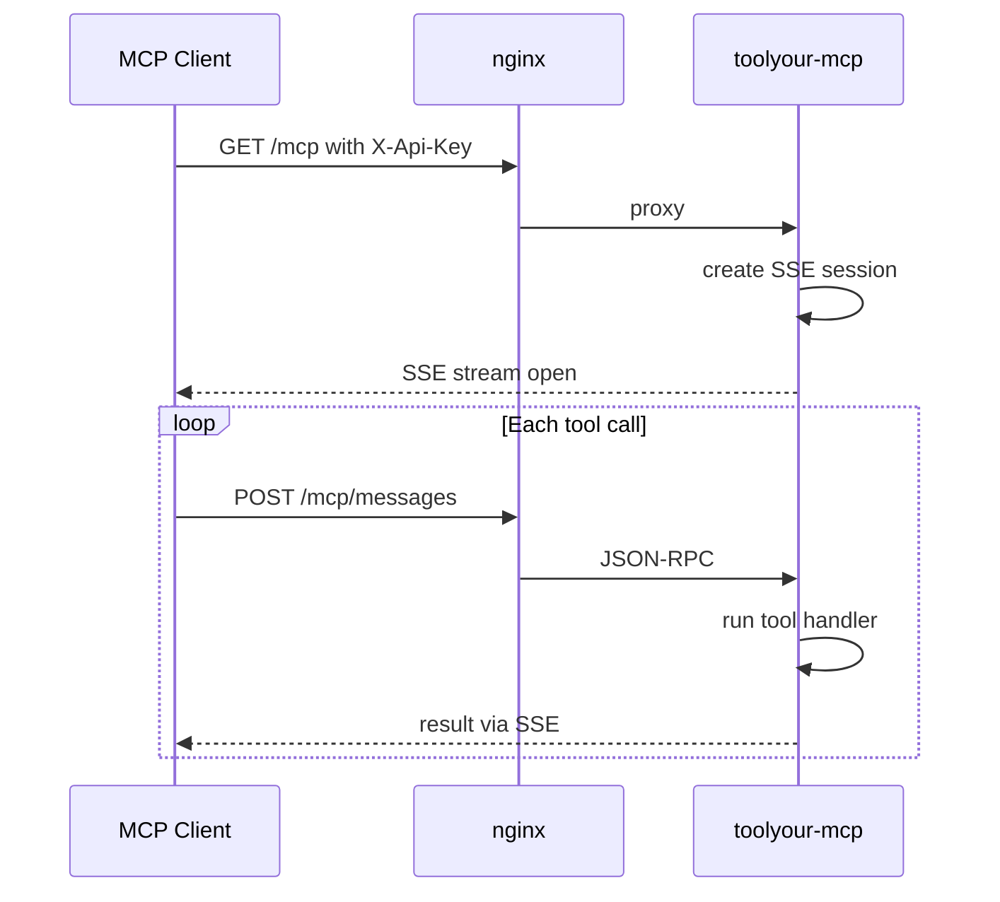
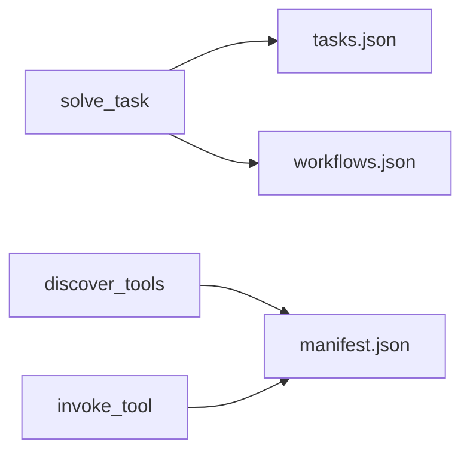
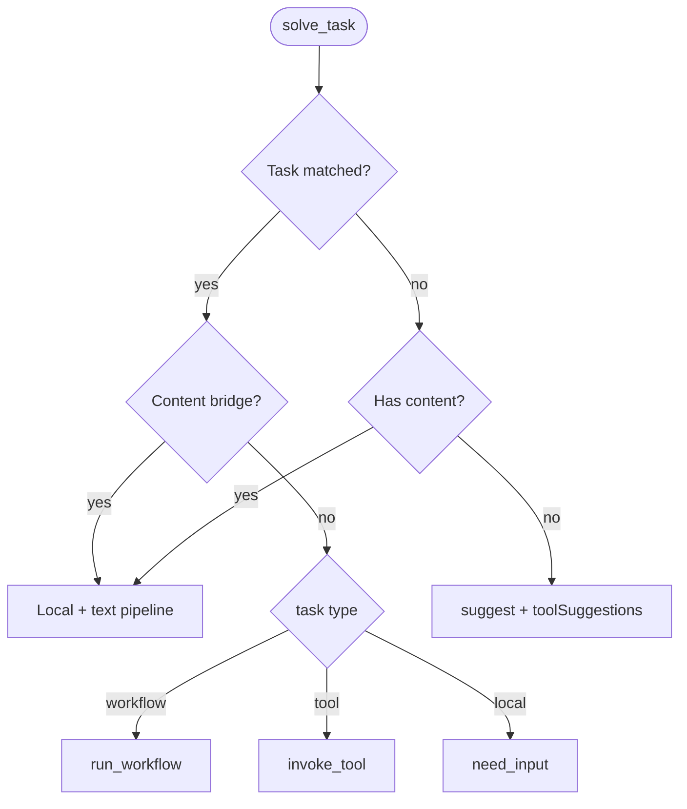
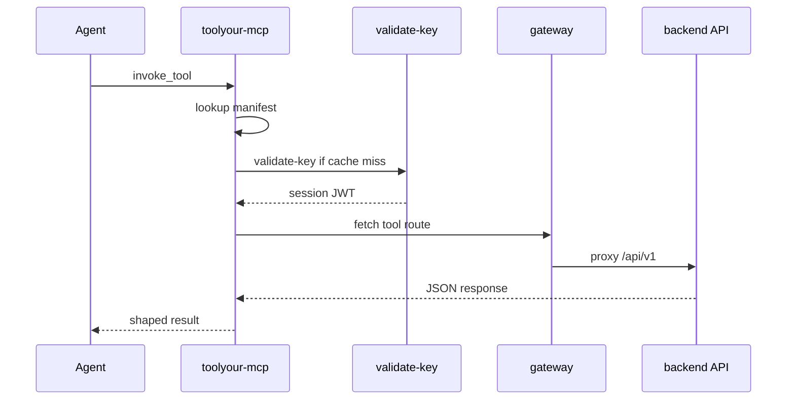
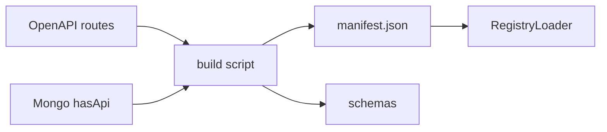
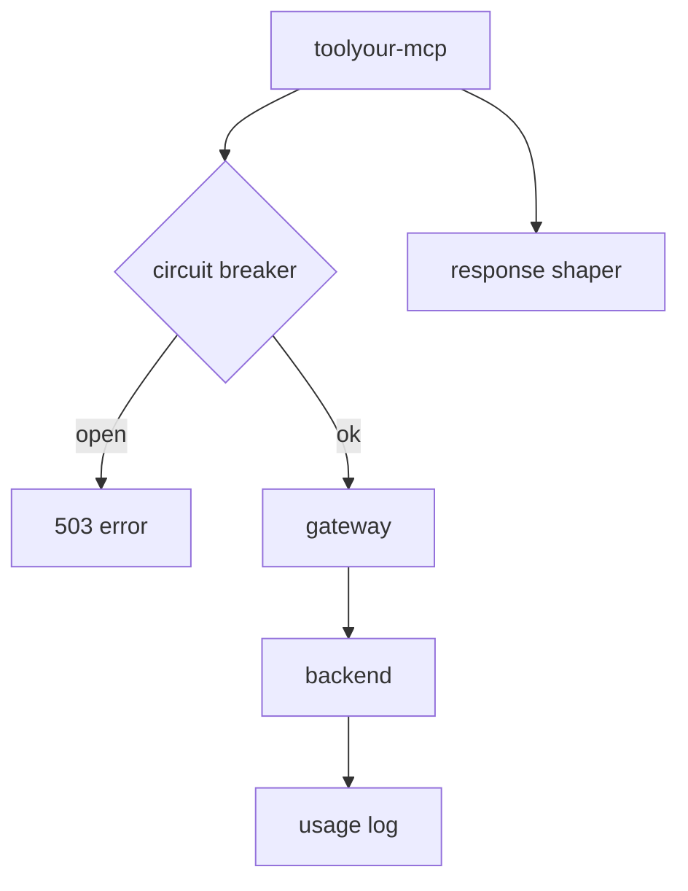

# ToolYour MCP — Architecture

How AI agents (Cursor, Claude Desktop, custom clients) communicate with ToolYour through the MCP gateway.

> **Viewing diagrams:** Sections include **ASCII diagrams** (work everywhere) plus **Mermaid** blocks (GitHub, [mermaid.live](https://mermaid.live)). If Mermaid does not render in Cursor, open this file on GitHub or paste a `mermaid` block into mermaid.live.

---

## 1. High-level system view

```text
  ┌──────────────┐
  │  AI Agent    │  Cursor / Claude / custom MCP client
  │  X-Api-Key   │
  └──────┬───────┘
         │
         ▼
  ┌──────────────┐     /mcp          ┌─────────────────────────────────┐
  │ nginx gateway│ ────────────────► │ toolyour-mcp :3090                │
  │ :8888 local  │                   │  SSE /mcp  ·  POST /mcp/messages │
  │ api.toolyour │ ◄── gateway ────  │  solve_task · registry · breaker │
  └──────┬───────┘                   └───────────┬─────────────────────┘
         │                                       │
         │ /api/v1/*                             │ validate-key
         ├──────────────────┐                    ▼
         │                  │            ┌──────────────┐
         ▼                  ▼            │ toolyour-saas│ usage / billing
  ┌─────────────┐   ┌─────────────┐      └──────────────┘
  │ Node APIs   │   │ Python APIs │
  │ SEO·text·AI │   │ docs·office │
  └─────────────┘   └─────────────┘

  Registry build:  OpenAPI routes  +  Mongo hasApi=true  →  manifest.json
```



**Key idea:** `toolyour-mcp` is a **thin orchestration layer**. It does not run tool logic, store files, or enforce quota itself. It routes agent requests to the same API gateway and backends that REST clients use.

---

## 2. Production vs local URLs

| Layer | Production | Local dev |
|-------|------------|-----------|
| MCP endpoint (agent config) | `https://api.toolyour.com/mcp` | `http://127.0.0.1:8888/mcp` |
| MCP service (direct) | Railway / `toolyour-mcp:3090` | `localhost:3090` |
| API gateway | nginx on `api.toolyour.com` | `localhost:8888` |
| SaaS validate-key | `/internal/validate-key` via gateway | `localhost:3002` |

Agents always talk to **gateway `/mcp`**, not to backends directly.

---

## 3. MCP transport (SSE)

ToolYour MCP uses the MCP SDK **HTTP + SSE** transport.

```text
  Agent                    nginx                 toolyour-mcp
    │                        │                        │
    │── GET /mcp + ApiKey ──►│── proxy ──────────────►│ open SSE session
    │◄──────────── SSE stream ────────────────────────│
    │                        │                        │
    │── POST /mcp/messages ─►│── ?sessionId=... ────►│ run MCP tool
    │◄──────── result on SSE ──────────────────────────│
    │                        │                        │
    │── close ───────────────┼───────────────────────►│ cleanup
```



| Route | Method | Purpose |
|-------|--------|---------|
| `/mcp` | `GET` | Open SSE session; requires `X-Api-Key` |
| `/mcp/messages` | `POST` | Send MCP JSON-RPC messages (`?sessionId=`) |
| `/health/mcp` | `GET` | Liveness via gateway |
| `/health/mcp/ready` | `GET` | Readiness (registry loaded) |

Auth on connect: `X-Api-Key`, `Authorization: ApiKey ty_…`, or `Bearer ty_…`.

---

## 4. MCP tools exposed to agents

Eight meta-tools — agents never see 231 raw backend endpoints at once.

```text
  MCP meta-tools (8)              Local config files
  ──────────────────              ──────────────────
  solve_task          ────────►   tasks.json, content-adapters.json, workflows.json
  discover_tools      ────────►   manifest.json
  get_tool_schema     ────────►   manifest.json + schemas/
  invoke_tool         ────────►   manifest.json → gateway → backend
  list_categories     ────────►   manifest.json
  list_skills         ────────►   skills/
  load_skill          ────────►   skills/*.md
  run_workflow        ────────►   workflows.json
```



| Tool | Bills quota? | What it does |
|------|--------------|--------------|
| `solve_task` | Only when a backend runs | Natural-language router → workflow, tool, or content bridge |
| `discover_tools` | No | Keyword search over 231 tool cards |
| `list_categories` | No | List tool families |
| `get_tool_schema` | No | Request/response schema for one `operationId` |
| `invoke_tool` | Yes | Call one API-backed tool |
| `list_skills` / `load_skill` | No | Curated playbooks (5 skills) |
| `run_workflow` | Yes (per step) | Server-side multi-step pipeline (3 workflows) |

---

## 5. solve_task decision flow

Primary entry point for agents.

```text
                    solve_task(goal, input)
                              │
              ┌───────────────┴───────────────┐
              │                               │
        task matched?                    no match
              │                               │
              ▼                               ▼
      content bridge?              has html/text/code?
         │      │                      │         │
        yes     no                    yes        no
         │      │                      │         │
         ▼      ▼                      ▼         ▼
      local   workflow/          bridge    suggest status
      audit   tool invoke                   + toolSuggestions
```



**Content bridge** (MCP-only, no backend URL fetch):

- Local HTML SEO audit (cheerio, free)
- Link extraction from HTML (free)
- Optional text tools: `headlineRestructurer`, `jargonBuster`, `piiScrub`, etc. (billed unless `enhance: false`)

---

## 6. Tool invocation path

Every billed execution follows the same path.

```text
  Agent
    │  invoke_tool(operationId, input)
    ▼
  toolyour-mcp
    │  1. lookup manifest.json
    │  2. validate-key (JWT cache 15 min)
    │  3. fetch gateway with headers:
    │       X-Api-Key, Bearer JWT, X-Transport=mcp, X-Request-Id
    ▼
  nginx gateway  ──►  Node API  or  Python API
    ▼
  toolyour-mcp  ──►  shape response (summarize if large)
    ▼
  Agent  ◄── compact JSON
```



### Headers forwarded to gateway

| Header | Purpose |
|--------|---------|
| `X-Api-Key` | Customer API key |
| `Authorization: Bearer <sessionToken>` | Short-lived JWT from validate-key |
| `X-Transport: mcp` | Usage analytics tag |
| `X-Request-Id` | Idempotency / dedup |
| `X-Mcp-Session-Id` | Correlate agent session |
| `X-Mcp-Operation-Id` | Which tool was invoked |

### Backend routing (gateway)

| Path prefix | Backend |
|-------------|---------|
| `/api/v1/documents`, `office`, `web`, `ebook`, `archive`, `audio`, `video`, `extract`, `text-intelligence` | **Python** (`toolyour-py-apis`) |
| All other `/api/v1/*` | **Node** (`toolyour-apis`) |

---

## 7. Registry — what tools MCP knows about

Built offline; loaded at MCP startup and refreshed every 5 minutes.

```text
  OpenAPI routes ──┐
                   ├──► build-mcp-registry.mjs ──► manifest.json (231 tools)
  Mongo hasApi ────┘                              schemas/*.json
                                                         │
                                                         ▼
                                                  RegistryLoader
```



**Inclusion rules:**

- Tool must be in OpenAPI route registry
- When `TOOLS_MONGO_URI` is set: must match Mongo `hasApi: true` validate paths
- Excluded: `noAuth` GET routes, website-only tools (`hasApi: false`)

**Not in manifest → not callable via MCP** (`tool_not_api_backed`).

---

## 8. Resilience and observability

```text
  toolyour-mcp
    ├── JWT cache (15 min)     → fewer validate-key calls
    ├── Circuit breaker        → stop calling sick backends
    ├── Response shaper        → large JSON → summary
    └── Logs + X-Transport=mcp → usage in RequestLog
```



| Mechanism | Config | Behavior |
|-----------|--------|----------|
| JWT session cache | 15 min TTL | Avoid validate-key on every invoke |
| Circuit breaker | 5 failures / 30s window | Stops hammering unhealthy backend |
| Response shaping | 8 KB threshold | Large outputs → summary + `dataRef` |
| Registry refresh | 300 s | Reload manifest without restart |
| Gateway timeout | 120 s | Abort long-running tools |

---

## 9. Full local dev topology

```text
┌─────────────────────────────────────────────────────────────────┐
│  Cursor / Agent                                                  │
│  mcpServers.toolyour.url = http://127.0.0.1:8888/mcp            │
│  headers.X-Api-Key = ty_...                                      │
└────────────────────────────┬────────────────────────────────────┘
                             │
                             ▼
┌─────────────────────────────────────────────────────────────────┐
│  nginx gateway (:8888)                                           │
│  /mcp ──────────► toolyour-mcp (:3090)                          │
│  /api/v1/* ─────► toolyour-apis (:8080)                         │
│  /api/v1/documents… ► toolyour-py-apis (:5000)                   │
│  /internal/* ───► toolyour-saas (:3002)                         │
└─────────────────────────────────────────────────────────────────┘
```

**Start order:** saas → apis → py-apis → mcp → gateway (or use your existing dev scripts).

---

## 10. What MCP does NOT do

| Responsibility | Owner |
|----------------|-------|
| Tool business logic | Node / Python APIs |
| Quota enforcement | SaaS + backends (via validate-key JWT) |
| File storage | Temp-files service / S3 presigned URLs |
| Website calculators (`hasApi: false`) | Not exposed |
| Page fetch for localhost URLs | Content bridge uses agent-supplied html/text/code instead |

---

## 11. Agent cheat sheet

```text
1. Connect     →  GET /mcp  (SSE)  +  X-Api-Key
2. Try first   →  solve_task("convert docx to pdf", { file: ... })
3. On miss     →  review toolSuggestions  OR  discover_tools("docx pdf")
4. Before run  →  get_tool_schema(operationId)
5. Execute     →  invoke_tool(operationId, input)
6. Local SEO   →  solve_task("audit my page", { html: "<!DOCTYPE..." })
```

---

## Related docs

- Customer: [MCP Quickstart](../toolyour-docs/customer/content/docs/mcp-quickstart.mdx)
- Customer: [MCP Discovery](../toolyour-docs/customer/content/docs/mcp-discovery.mdx)
- Internal: [mcp-architecture.mdx](../toolyour-docs/internal/content/docs/mcp-architecture.mdx)
- Dashboard: `/developers/mcp`
